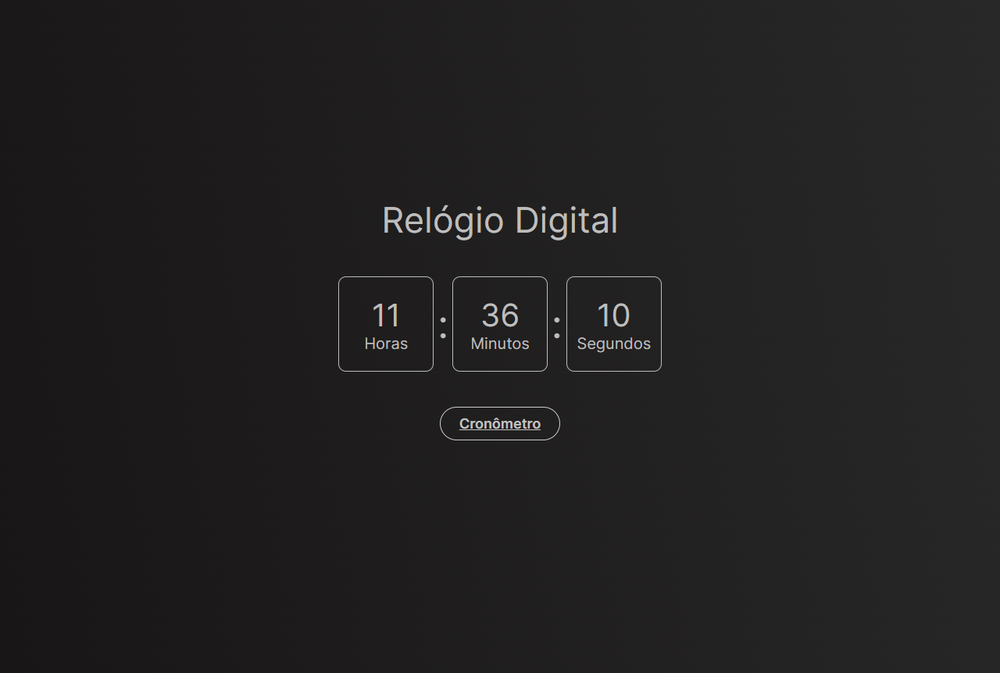

# Relógio Digital



Este projeto apresenta um relógio digital simples, construído utilizando JavaScript, HTML e CSS. O objetivo é demonstrar como criar um relógio funcional na web, permitindo visualizar a hora atual de forma dinâmica.

### Ajustes e melhorias

O projeto ainda está em desenvolvimento e as próximas atualizações serão voltadas nas seguintes tarefas:

- [x] Implementação inicial do relógio
- [x] Melhorias na interface do usuário
- [x] Adição de funções adicionais (alarme)
- [ ] Integração com APIs externas (hora mundial)
- [ ] Refatoração do código para melhor performance

## 💻 Pré-requisitos

Antes de começar, verifique se você atendeu aos seguintes requisitos:

- Você instalou a versão mais recente de `<linguagem / dependência / requeridos>`
- Você tem uma máquina `<Windows / Linux / Mac>`. Indique qual sistema operacional é compatível / não compatível.
- Você leu `<guia / link / documentação_relacionada_ao_projeto>`.

## 🚀 Instalando <digital-watch>

Para instalar o <digital-watch>, siga estas etapas:


Linux e macOS:

```
git clone https://github.com/seu_usuario/relogio-digital.git
cd relogio-digital
npm install
```

Windows:

```
git clone https://github.com/seu_usuario/relogio-digital.git
cd relogio-digital
npm install
```

## ☕ Usando <digital-watch>

Para usar <digital-watch>, siga estas etapas:

```
Para usar o Relógio Digital, siga estas etapas:

Abra o terminal ou prompt de comando.
Navegue até o diretório onde o projeto foi clonado.
Execute o comando npm start para iniciar o servidor de desenvolvimento.
Abra seu navegador e vá para http://localhost:3000.
```

Você agora pode interagir com o relógio digital através da interface do navegador.

## 📫 Contribuindo para <digital-watch>

Para contribuir com <digital-watch>, siga estas etapas:

1. Bifurque este repositório.
2. Crie um branch: `git checkout -b <master>`.
3. Faça suas alterações e confirme-as: `git commit -m '<mensagem_commit>'`
4. Envie para o branch original: `git push origin <digital-watch>`
5. Crie a solicitação de pull.

Como alternativa, consulte a documentação do GitHub em [como criar uma solicitação pull](https://help.github.com/en/github/collaborating-with-issues-and-pull-requests/creating-a-pull-request).

## 🤝 Colaboradores

Agradecemos às seguintes pessoas que contribuíram para este projeto:

<table>
  <tr>
    <td align="center">
      <a href="#" title="defina o titulo do link">
        <br>
        <sub>
          <b>Iuri Silva</b>
        </sub>
      </a>
    </td>
    <td align="center">
      <a href="#" title="defina o titulo do link">
        <br>
        <sub>
          <b>Mark Zuckerberg</b>
        </sub>
      </a>
    </td>
    <td align="center">
      <a href="#" title="defina o titulo do link">
        <br>
        <sub>
          <b>Steve Jobs</b>
        </sub>
      </a>
    </td>
  </tr>
</table>

## 😄 Seja um dos contribuidores

Quer fazer parte desse projeto? Clique [AQUI](CONTRIBUTING.md) e leia como contribuir.

## 📝 Licença

Esse projeto está sob licença. Veja o arquivo [LICENÇA](LICENSE.md) para mais detalhes.
